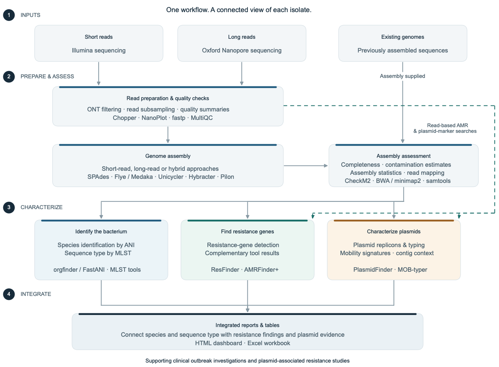

# amr-tools

`amr-tools` is a nextflow pipeline to process sequencing data of Antimicrobial Multi-Resistance bacteria with
a focus on plasmids. It is actively developed by [Diego Andrey Lab](https://www.unige.ch/medecine/demed/en/research/andrey-diego)
at the [University of Geneva](https://www.unige.ch/medecine) and [Geneva University Hospital](https://www.hug.ch).


|  |
|:--:|
| **Figure 1:** *Overview of `amr-tools` pipeline* |


# Installation

`amr-tools` depends on nextflow, that can be installed with: 

```bash
curl -s https://get.nextflow.io | bash
```

Test `amr-tools` installation:

```bash
nextflow run pradosj/amr-tools -main-script tests/main.nf
```

# Usage

## Local computer

Running the pipeline on a local computer requires [`docker`](https://www.docker.com) 
(to run containerized software) and [`nextflow`](https://www.nextflow.io).

If the FASTA files to process are in subfolder 'assemblies/' of your working directory

```bash
nextflow run pradosj/amr-tools --assemblies.fasta='assemblies/*.fasta'
```

## HPC

To run the pipeline on a HPC cluster with `slurm` and `singularity` use `-profile=hpc`:


## Pipeline outputs

By default, pipeline outputs are stored in `results/` but it can controlled with 
option `-output-dir`.

The output folder `results` has the following organization:

 - `results/reports`: Folder containing final reports, with QC metrics and annotations

 - `results/db`: Folder of databases used
 
 - `results/assemblies`: FASTA of assembled genomes

 - `results/reads`


